<div align="center">

# GlobalRoamer AI Observability Layer

</div>
<div align="center">


</div>

---


---

AI-powered telecom operational intelligence platform reducing MTTR through semantic incident correlation, AI-assisted root-cause analysis, and operational memory retrieval.

## 🎬 Demo Video

Click the image above to watch the full demo walkthrough: https://youtu.be/V9X12x59-AI

---

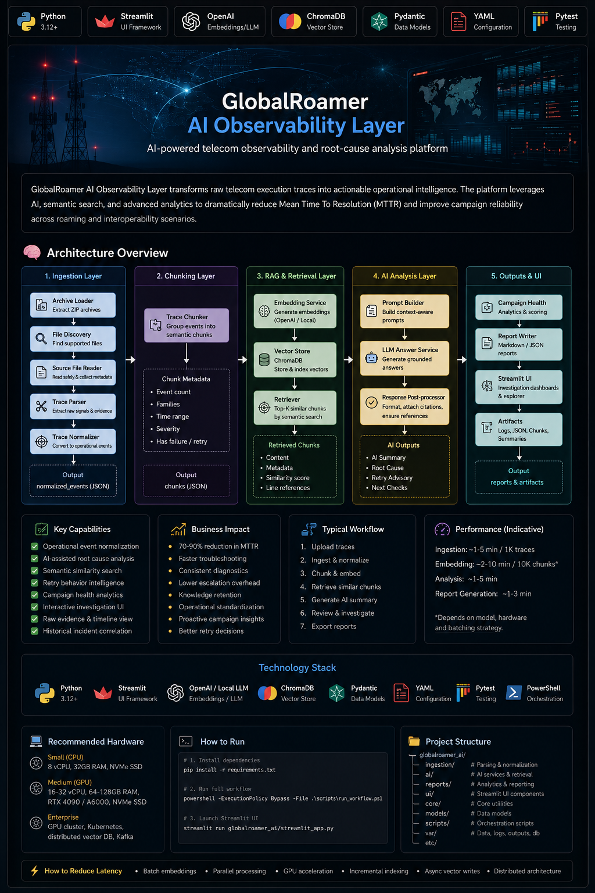

---

| Metric | Improvement |
|---|---|
| MTTR Reduction | 70–90% |
| Investigation Speed | 10x faster |
| Historical Incident Correlation | Automated |
| Retry Pattern Detection | AI-assisted |
| Root Cause Standardization | Enabled |

---

# Executive Summary

GlobalRoamer AI Observability Layer transforms raw telecom execution traces into structured operational intelligence using:

- AI-assisted root cause analysis
- Semantic similarity search
- Historical incident correlation
- Retry recommendation analysis
- Campaign health scoring
- Operational evidence normalization
- Near-real-time engineering dashboards

The platform reduces Mean Time To Resolution (MTTR) for telecom operational incidents by converting fragmented low-level evidence into actionable operational insights.

---

# Business Problem

Telecom roaming and interoperability campaigns generate:

- Massive trace volumes
- Low-level signaling evidence
- Repetitive operational failures
- Cross-domain troubleshooting complexity
- Manual investigation overhead
- Slow escalation cycles
- Inconsistent operational diagnostics

Typical operational investigation requires:

- Manual log parsing
- Cross-team correlation
- Historical comparison
- Retry behavior analysis
- Root cause hypothesis generation

Investigation often takes:

- 30 minutes to several hours per testcase
- Multiple engineers
- Multiple operational domains

---

# Screenshots

## Investigation Dashboard

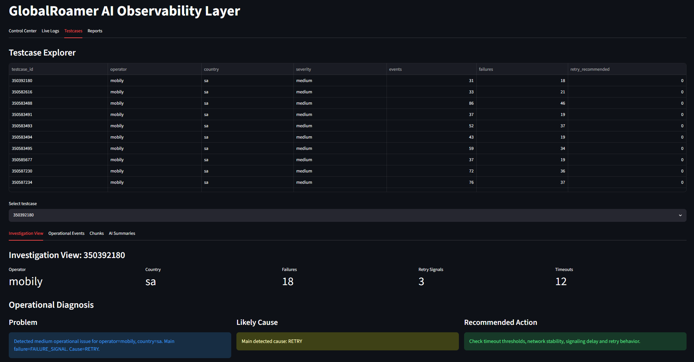
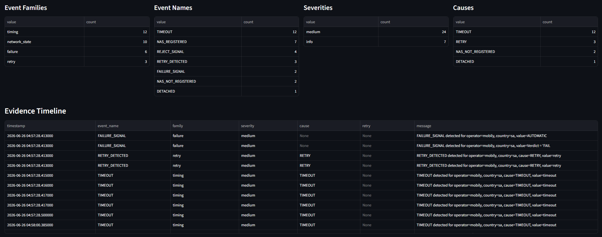

---

## AI Investigation Summary

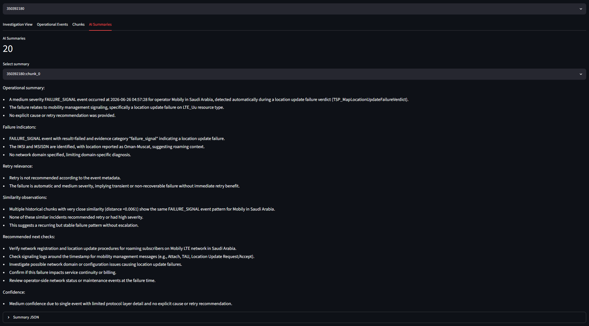

---

## Similar Operational Chunks

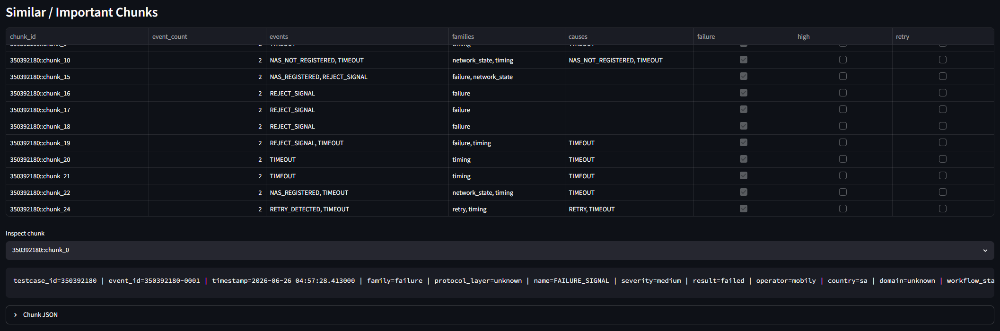

---

## Raw Evidence Analysis

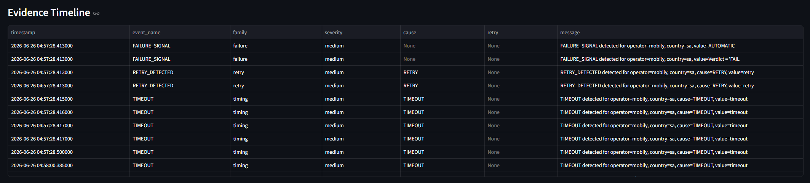
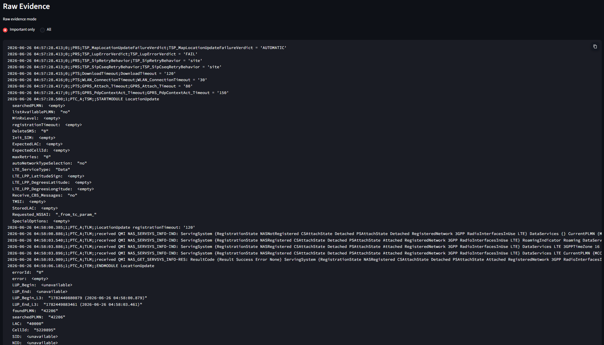
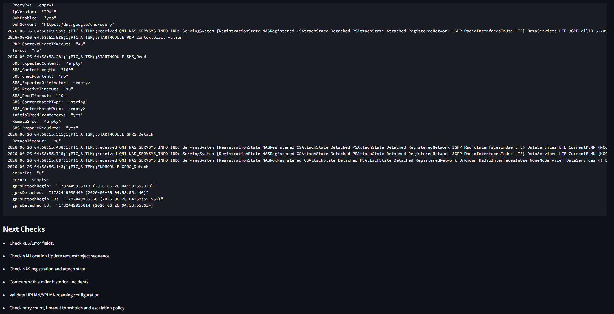

---

## Campaign Health Dashboard

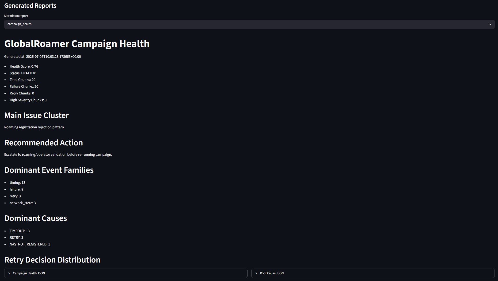

---

## Chunk Explorer

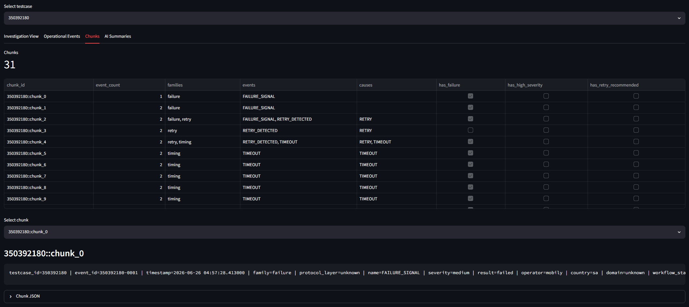
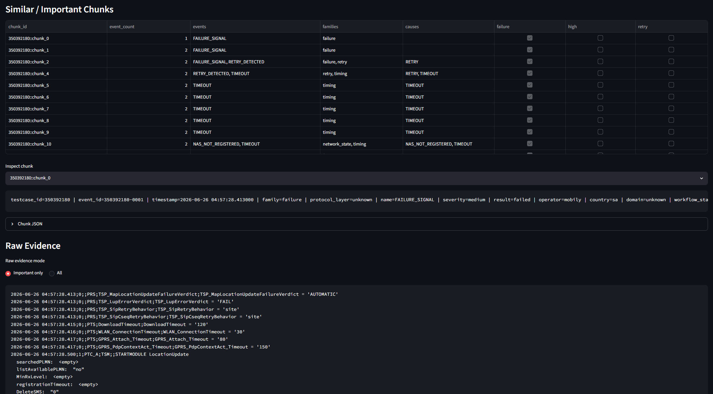

---

## Testcase Explorer

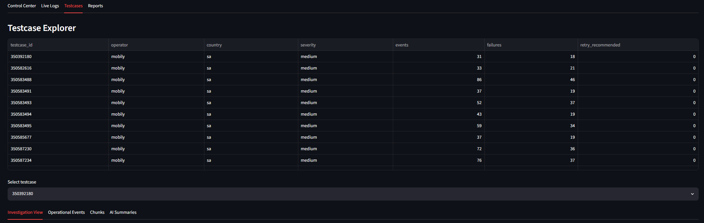

---

# Running The Project

## Create Virtual Environment

```bash
python -m venv .venv
```

---

## Install Dependencies

```bash
pip install -r requirements.txt
```

---

## Run Full Workflow

```powershell
powershell -ExecutionPolicy Bypass -File .\scripts\run_workflow.ps1
```

---

## Launch Streamlit UI

```bash
streamlit run globalroamer_ai/streamlit_app.py
```

---

# Testing

```bash
pytest tests -v
```

---

## Docker Deployment

```powershell
docker compose build
docker compose up
```

---

# Key Engineering Challenges

- Parsing heterogeneous telecom trace formats
- Maintaining semantic context during chunking
- Preventing embedding noise amplification
- Handling high-volume historical vector retrieval
- Balancing AI latency vs investigation speed
- Designing offline-capable AI infrastructure
- Reducing hallucination risk in operational summaries
- Preserving deterministic operational evidence

---

# Solution Overview

The platform creates an AI-driven observability layer on top of telecom operational traces.

It automatically:

1. Loads raw telecom traces
2. Parses and normalizes operational evidence
3. Extracts structured operational events
4. Chunks correlated evidence
5. Generates embeddings
6. Stores historical vectors
7. Performs semantic similarity analysis
8. Detects operational patterns
9. Generates AI investigation summaries
10. Produces campaign-level health analytics
11. Provides interactive operational UI

---

# AI Observability Architecture

```text
                    ┌─────────────────────┐
                    │ Telecom Trace Files │
                    └──────────┬──────────┘
                               │
                               ▼
                 ┌──────────────────────────┐
                 │ Ingestion Layer          │
                 │ trace_loader.py          │
                 │ trace_parser.py          │
                 │ trace_normalizer.py      │
                 └──────────┬───────────────┘
                            │
                            ▼
                ┌───────────────────────────┐
                │ Operational Event Model   │
                │ normalized_events         │
                └──────────┬────────────────┘
                           │
                           ▼
                ┌───────────────────────────┐
                │ Chunking Engine           │
                │ trace_chunker.py          │
                └──────────┬────────────────┘
                           │
                           ▼
                ┌───────────────────────────┐
                │ AI / Semantic Layer       │
                │ embedding_service.py      │
                │ vector_store.py           │
                │ similarity_search.py      │
                │ ai_summary_service.py     │
                └──────────┬────────────────┘
                           │
                           ▼
                ┌───────────────────────────┐
                │ Analytics & Reporting     │
                │ campaign_health.py        │
                │ root_cause_service.py     │
                │ retry_advisor.py          │
                │ report_writer.py          │
                └──────────┬────────────────┘
                           │
                           ▼
                ┌───────────────────────────┐
                │ Streamlit UI              │
                │ Investigation Dashboard   │
                └───────────────────────────┘
```

---

# Architecture Evolution

| Phase | Architecture |
|---|---|
| Phase 1 | Local prototype |
| Phase 2 | Single-node enterprise |
| Phase 3 | Distributed AI processing |
| Phase 4 | Streaming operational intelligence |
| Phase 5 | Autonomous operational agents |

---

# Operational Risks

- embedding drift
- vector DB growth
- LLM hallucinations
- high GPU costs
- telecom data sensitivity
- operational false positives
- excessive alert amplification

---

# Operational Workflow

```text
Engineer receives alert
        ↓
Select testcase
        ↓
AI summarizes failure
        ↓
System retrieves similar incidents
        ↓
Retry analysis generated
        ↓
Root cause hypothesis suggested
        ↓
Recommended next checks
        ↓
Engineer escalates faster
```

---

# Scalability Targets

Prototype:
- 10k chunks
- local vector DB

Target:
- 100M+ operational chunks
- distributed embeddings
- streaming ingestion
- multi-region vector search

---

# Why This Matters

Telecom operational teams process massive volumes of roaming and signaling traces under strict SLA constraints.

Traditional troubleshooting is:
- reactive
- manual
- repetitive
- dependent on senior engineer expertise

This platform transforms operational troubleshooting into:
- searchable operational memory
- AI-assisted diagnostics
- semantic incident correlation
- accelerated escalation workflows

The result is lower MTTR, reduced operational fatigue, and faster campaign stabilization.

---

# Engineering Ownership

Primary responsibilities included:

- AI observability platform architecture
- operational event normalization design
- semantic retrieval pipeline implementation
- vector database integration
- Streamlit operational dashboard development
- AI investigation workflow design
- retry analysis strategy
- campaign health analytics
- workflow orchestration
- enterprise scalability planning
- operational UX design

---

# Non-Functional Requirements

| Requirement | Strategy |
|---|---|
| Scalability | distributed chunk processing |
| Reliability | isolated workflow stages |
| Latency | batching + async processing |
| Auditability | raw evidence preservation |
| Security | internal inference support |
| Maintainability | layered architecture |
| Extensibility | modular AI services |
| Observability | structured logging |
| Cost optimization | local embedding support |

---

# Operational AI Maturity Roadmap

| Level | Capability |
|---|---|
| Level 1 | Trace normalization |
| Level 2 | Semantic retrieval |
| Level 3 | AI investigation summaries |
| Level 4 | Cross-campaign intelligence |
| Level 5 | Predictive operational analytics |
| Level 6 | Autonomous remediation agents |

---

# Current Limitations

Current prototype limitations:

- synchronous embedding pipeline
- local ChromaDB scalability constraints
- Streamlit UI rendering overhead
- limited distributed orchestration
- absence of GPU scheduling
- limited multi-tenant isolation
- batch-oriented processing model

---

# Prototype Runtime Characteristics

| Operation | Current Runtime |
|---|---|
| Trace parsing | ~1–2 sec/testcase |
| Chunk generation | ~100–300 chunks/min |
| Embedding generation | bottleneck stage |
| Similarity search | sub-second |
| Full testcase investigation | ~10–30 sec |
| Full campaign processing | ~2–4 hours |

---

# Enterprise Concerns

- tenant isolation
- telecom compliance
- PII masking
- RBAC
- auditability
- air-gapped deployment
- GPU resource scheduling
- operational observability
- inference cost optimization
- SLA management

---

# Observability Metrics

The platform is designed to expose:

- ingestion throughput
- embedding latency
- chunk generation duration
- vector retrieval latency
- AI generation latency
- retry correlation accuracy
- campaign health score
- testcase failure density
- semantic similarity confidence

---

# AI Reliability Strategy

The platform minimizes hallucination risk by:

- grounding AI summaries in retrieved operational chunks
- exposing raw evidence alongside AI conclusions
- preserving deterministic normalized event structures
- separating AI interpretation from source telemetry
- allowing engineers to inspect retrieved similarity context

---

# Why RAG Instead of Fine-Tuning?

RAG was selected because:

- telecom operational data changes frequently
- historical incidents continuously evolve
- retrieval is cheaper than retraining
- operational evidence must remain inspectable
- deterministic trace visibility is required

---

# System Architecture Principles

## 1. Separation of Concerns

Project is split into:

| Layer | Responsibility |
|---|---|
| ingestion | raw trace parsing |
| ai | semantic processing |
| reports | analytics & reporting |
| ui | visualization |
| core | shared infrastructure |
| models | operational schemas |

---

## 2. Offline-first Processing

The platform can run:

- fully local
- disconnected environments
- secured telecom infrastructure
- internal AI infrastructure

without dependency on public SaaS APIs.

---

## 3. Incremental AI Adoption

AI layer is isolated.

The platform can operate:

- with AI
- partially with AI
- without AI

allowing gradual enterprise adoption.

---

# Project Structure

```text
globalroamer_ai/
│
├── ai/
│   ├── ai_summary_service.py
│   ├── embedding_service.py
│   ├── retry_advisor.py
│   ├── root_cause_service.py
│   ├── similarity_search.py
│   └── vector_store.py
│
├── core/
│   ├── app_config.py
│   ├── exceptions.py
│   └── setup_logger.py
│
├── ingestion/
│   ├── trace_chunker.py
│   ├── trace_loader.py
│   ├── trace_normalizer.py
│   └── trace_parser.py
│
├── models/
│   └── operational_models.py
│
├── reports/
│   ├── campaign_health.py
│   └── report_writer.py
│
├── ui/
│   ├── log_reader.py
│   ├── pipeline_runner.py
│   ├── result_loader.py
│   └── views.py
│
├── analyze_main.py
├── ingest_main.py
├── report_main.py
└── streamlit_app.py
```

---

# Data Lifecycle

```text
Raw traces
    ↓
Normalized events
    ↓
Operational chunks
    ↓
Embeddings
    ↓
Vector retention
    ↓
Historical archival
```

---

# User Personas

| Role | Benefit |
|---|---|
| NOC Engineer | faster incident triage |
| Roaming Engineer | retry diagnostics |
| Operations Manager | campaign visibility |
| AI Team | operational datasets |
| Support Engineer | historical correlation |

---

# Failure Isolation Strategy

The platform isolates failures between:

- ingestion
- embedding generation
- vector indexing
- AI summarization
- reporting

---

# Processing Pipeline

## Step 1 — Ingestion

### Responsibilities

- Read telecom traces
- Parse evidence
- Normalize events
- Extract operational metadata

### Output

Structured operational events:

```json
{
  "event_name": "TIMEOUT",
  "severity": "medium",
  "family": "timing",
  "operator": "mobily",
  "country": "sa"
}
```

---

## Step 2 — Chunking

Events are grouped into semantic operational chunks.

Purpose:

- preserve contextual continuity
- improve vector quality
- reduce embedding noise

---

## Step 3 — Embedding Generation

Each chunk is transformed into embeddings using:

- sentence-transformers
- OpenAI embeddings
- internal LLM embeddings

Supported architectures:

- local CPU
- local GPU
- remote inference APIs

---

## Step 4 — Similarity Search

Platform identifies:

- similar historical incidents
- recurring failures
- retry-related patterns
- timeout clusters
- roaming registration issues

---

## Step 5 — AI Investigation Summary

The AI layer produces:

- operational explanation
- probable cause
- retry analysis
- escalation hints
- next investigation steps

---

# Operational UI

The Streamlit UI provides:

## Testcase Explorer

- testcase severity
- failures
- retries
- operational counts

## Investigation Dashboard

- event timelines
- failure families
- root causes
- operational diagnostics

## Similar Chunks

- historical similarity correlation
- semantic operational clustering

## AI Investigation Summary

- human-readable operational explanation
- escalation recommendations
- confidence scoring

## Raw Evidence Viewer

- low-level telecom traces
- parsed operational context

## Campaign Health

- campaign scoring
- dominant issue clusters
- operational recommendations

---

# Example Operational Use Cases

## Use Case 1 — Timeout Storm Detection

The system identifies:

- abnormal TIMEOUT spike
- repeated retry escalation
- recurring attach failures

Recommended action:

- validate roaming configuration
- inspect timeout thresholds
- analyze signaling latency

---

## Use Case 2 — Historical Incident Correlation

The system finds:

- semantically similar incidents
- prior operational patterns
- recurring operator-specific failures

This significantly reduces investigation effort.

---

## Use Case 3 — Retry Policy Analysis

AI layer evaluates:

- retry frequency
- retry timing
- escalation thresholds
- campaign instability indicators

---

# Engineering Value

## Reduced MTTR

Traditional investigation:

- 30–90 minutes

AI-assisted investigation:

- 2–10 minutes

Potential MTTR reduction:

- 70–90%

---

## Operational Standardization

Platform creates consistent:

- root-cause diagnostics
- retry recommendations
- operational classifications

---

## Historical Operational Memory

The vector database acts as:

- operational memory
- incident knowledge base
- semantic troubleshooting engine

---

# Business Value

## Faster Incident Resolution

Reduces operational downtime and escalation delays.

---

## Reduced Senior Engineer Dependency

Junior engineers gain access to:

- historical knowledge
- AI-generated guidance
- operational recommendations

---

## Campaign Reliability Improvement

The platform proactively identifies:

- unstable retry behavior
- timeout escalation
- recurring failure clusters

before large-scale production impact.

---

## Knowledge Retention

Operational expertise becomes searchable and reusable.

---

# Technology Stack

| Area | Technology |
|---|---|
| Language | Python 3.12 |
| UI | Streamlit |
| Vector DB | ChromaDB |
| AI Embeddings | sentence-transformers |
| LLM Integration | OpenAI / Local LLM |
| Data Models | Pydantic |
| Logging | Python logging |
| Testing | pytest |
| Packaging | pyproject.toml |
| Config | YAML |
| OS | Linux / Windows |

---

# Recommended Production Hardware

## Small Environment

### CPU-only

- 8 vCPU
- 32 GB RAM
- NVMe SSD

Supports:

- low-medium campaigns
- batch investigations

---

## Medium Production

### GPU-enabled

- 16–32 vCPU
- 64–128 GB RAM
- NVIDIA RTX 4090 / A6000
- NVMe SSD

Supports:

- high-volume campaigns
- local embeddings
- local LLM inference

---

## Enterprise Scale

### Distributed AI Infrastructure

- Kubernetes
- GPU node pools
- distributed vector search
- Kafka ingestion
- centralized observability

---

# Future Distributed Architecture

```text
Trace Producers
      ↓
Kafka
      ↓
Ingestion Workers
      ↓
Normalization Service
      ↓
Chunking Cluster
      ↓
Embedding GPU Service
      ↓
Qdrant Cluster
      ↓
AI Investigation Service
      ↓
Operational UI / APIs
```
---

# Latency Targets

| Stage | Target |
|---|---|
| Parsing | < 1 sec |
| Chunking | < 2 sec |
| Embedding | < 5 sec |
| Retrieval | < 500 ms |
| AI summary | < 10 sec |
| Full investigation | < 30 sec |

---

# Platform Observability

Recommended monitoring stack:

- Prometheus
- Grafana
- Loki
- OpenTelemetry
- Tempo
- Structured JSON logging
- Distributed tracing

---

# Deployment Modes

- Local developer mode
- Single-node enterprise mode
- GPU workstation mode
- Distributed Kubernetes deployment
- Air-gapped telecom deployment

---

# Performance Bottlenecks

Current bottlenecks:

| Area | Problem |
|---|---|
| embeddings | synchronous processing |
| chunking | sequential execution |
| vector writes | blocking inserts |
| report generation | full dataset scans |
| Streamlit | large dataframe rendering |

---

# How To Reduce Latency

## 1. Batch Embeddings

Current:

```text
1 chunk -> 1 embedding request
```

Improved:

```text
100 chunks -> 1 batch request
```

Expected gain:

- 5x–20x faster

---

## 2. Parallel Chunk Processing

Use:

- asyncio
- multiprocessing
- Ray
- Dask

Expected gain:

- 3x–8x faster

---

## 3. GPU Embeddings

Move from CPU embeddings to:

- CUDA inference
- ONNX acceleration
- TensorRT

Expected gain:

- 10x–50x faster

---

## 4. Incremental Processing

Instead of:

```text
full reprocessing
```

Use:

```text
only new traces
```

Expected gain:

- massive runtime reduction

---

## 5. Async Vector Storage

Replace synchronous writes with:

- buffered inserts
- async pipelines

---

## 6. Distributed Processing

Production-grade future architecture:

```text
Kafka
  ↓
Worker Pool
  ↓
Embedding Service
  ↓
Vector DB Cluster
  ↓
AI Analysis
```

---

# Internal AI Infrastructure Recommendations

## Replace External APIs

Move from:

- public OpenAI APIs

To:

- internal inference servers
- vLLM
- Ollama
- TGI
- NVIDIA NIM

Benefits:

- lower cost
- lower latency
- data privacy
- telecom compliance

---

# Recommended Enterprise AI Stack

| Component | Recommended |
|---|---|
| LLM Serving | vLLM |
| Embeddings | BGE / E5 |
| Vector DB | Qdrant |
| Queue | Kafka |
| Workflow | Airflow |
| Monitoring | Prometheus/Grafana |
| Tracing | OpenTelemetry |
| Serving | FastAPI |
| GPU orchestration | Kubernetes |

---

# Cost Considerations

## Current Prototype

### Monthly

| Resource | Estimated |
|---|---|
| Local machine | minimal |
| OpenAI usage | $50–300 |
| Storage | low |
| Streamlit | negligible |

---

## Enterprise Deployment

### Monthly

| Resource | Estimated |
|---|---|
| GPU infrastructure | $2k–10k |
| Vector DB cluster | $500–2k |
| Storage | $100–1k |
| Monitoring stack | $200–1k |

---

# Security Considerations

## Telecom-grade requirements

Recommended:

- internal inference
- isolated vector databases
- encryption at rest
- RBAC
- audit logging
- PII masking
- secure trace storage

---

# Reliability Considerations

## Recommended Improvements

### Add

- retry queues
- dead-letter queues
- health checks
- observability metrics
- tracing
- structured logs
- SLA dashboards

---

# Future Improvements

## Near-term

- async processing
- GPU embeddings
- incremental indexing
- distributed workers

## Mid-term

- anomaly detection
- automated escalation
- real-time streaming ingestion
- operational forecasting

## Long-term

- autonomous AI investigation agents
- AI-assisted remediation
- self-healing operational workflows

---

# Example Metrics

| Metric | Current | Target |
|---|---|---|
| MTTR | 60 min | 5–10 min |
| Investigation effort | high | low |
| Historical correlation | manual | automated |
| Retry analysis | manual | AI-assisted |
| Root cause consistency | inconsistent | standardized |

---

# Design Tradeoffs

| Decision | Benefit | Tradeoff |
|---|---|---|
| Streamlit UI | fast delivery | limited enterprise UI flexibility |
| ChromaDB | simple local vector DB | limited distributed scalability |
| Local filesystem storage | simplicity | weak distributed support |
| YAML config | operational simplicity | validation complexity |
| Batch workflow | reliability | higher latency |

---

# Intended Audience

- Telecom Operations Engineers
- Roaming Engineers
- NOC Teams
- Incident Response Teams
- AI/ML Engineering Teams
- Principal Engineers
- Operational Analytics Teams

---

# Conclusion

GlobalRoamer AI Observability Layer demonstrates how AI and semantic operational intelligence can dramatically improve telecom operational diagnostics.

The system transforms:

```text
raw telecom traces
```

into:

```text
AI-assisted operational intelligence
```

with measurable improvements in:

- MTTR
- operational consistency
- historical incident reuse
- campaign stability
- escalation quality
- engineering productivity

while creating a foundation for future autonomous operational AI systems.
